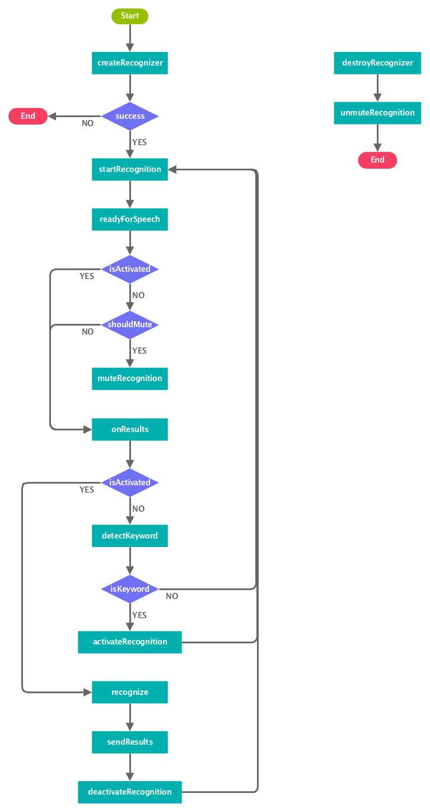

# KontinuousSpeechRecognizer
[](https://jitpack.io/#StephenVinouze/KontinuousSpeechRecognizer)
[](https://travis-ci.org/StephenVinouze/KontinuousSpeechRecognizer)
[](https://android-arsenal.com/api?level=14)
[](https://github.com/StephenVinouze/KontinuousSpeechRecognizer/blob/master/LICENSE)

## Gradle Dependency

Add this in your root `build.gradle` file:

```gradle
allprojects {
	repositories {
		// ... other repositories
		maven { url "https://jitpack.io" }
	}
}
```
Then add the following dependency in your project.

```gradle
dependencies {
  compile "com.github.StephenVinouze.KontinuousSpeechRecognizer:core:1.0.2"
}
```

## Prelude

Speech recognition is designed to listen commands for a brief moment and deactivate on its own. We wanted to mimic the "OK Google" recognition pattern, hence this library that must be used with special care to prevent battery drain.

The recognizer is managed on its own via the **KontinuousRecognitionManager** and exposes a few utilitary methods such as `startRecognition`, `stopRecognition`, `cancelRecognition` and `destroyRecognizer`. It is up to you to manage the lifecycle of this manager from your Activity/Service.

The recognizer will be listening and be respawned all the time once you call `startRecognition` and until you call `stopRecognition`. It expects an activation keyword, such as "Ok Google", then once detected will yield the result to the client and be deactivated until it receives once again the keyword. A sound system will be heard once the activation keyword is detected but you can decide to mute it all.

The workflow is explained as follow :



## Getting started

In your *AndroidManifest.xml* file, add the following line if your manifest merger is disabled :

```xml
<uses-permission android:name="android.permission.RECORD_AUDIO" />
 ```
 
 If you are developing an application targeting SDK 23, remember to take care of runtime permission.
 
 In your Activity, instanciate the **KontinuousRecognitionManager** :
 
 ```kotlin
 
 companion object {
    /**
     * Put any keyword that will trigger the speech recognition
     */
    private const val ACTIVATION_KEYWORD = "<YOUR_ACTIVATION_KEYWORD"
}
 
lateinit var recognitionManager: KontinuousRecognitionManager
 
override fun onCreate(savedInstanceState: Bundle?) {
    super.onCreate(savedInstanceState)
    setContentView(R.layout.<your_activity_layout>)

    recognitionManager = KontinuousRecognitionManager(this, activationKeyword = ACTIVATION_KEYWORD, callback = this)
    
    // Request runtime permission if not granted yet
}

override fun onDestroy() {
    recognitionManager.destroyRecognizer()
    super.onDestroy()
}

override fun onResume() {
    super.onResume()

    if (ContextCompat.checkSelfPermission(this, Manifest.permission.RECORD_AUDIO) == PackageManager.PERMISSION_GRANTED) {
        startRecognition()
    }
}

override fun onPause() {
    stopRecognition()
    super.onPause()
}
 ```
 
We also provide an optional **RecognitionCallback** interface that yields all **RecognitionListener** callbacks in addition to a few custom ones corresponding to the keyword detection and the speech recognition availability (it is known to be unsopported on a range of devices).

## Pull requests

I welcome and encourage all pull requests. I might not be able to respond as fast as I would want to but I endeavor to be as responsive as possible.

All PR must:

1. Be written in Kotlin
2. Maintain code style
3. Indicate whether it is a enhancement, bug fix or anything else
4. Provide a clear description of what your PR brings
5. Enjoy coding in Kotlin :)
